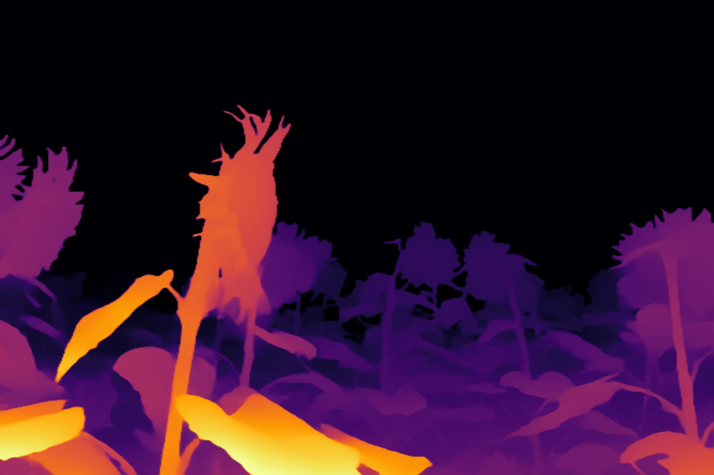
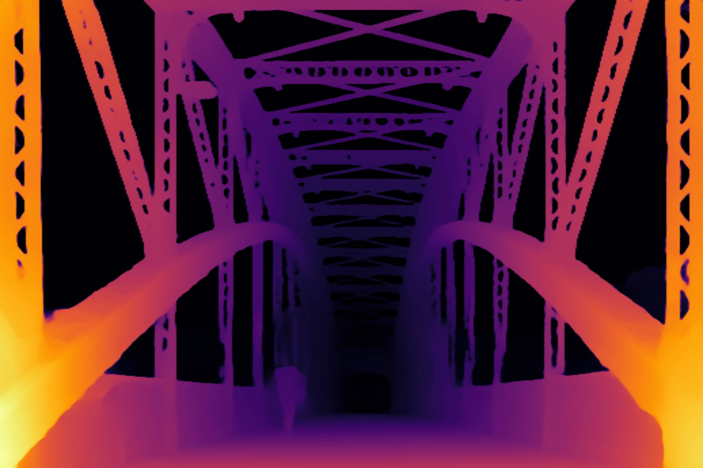
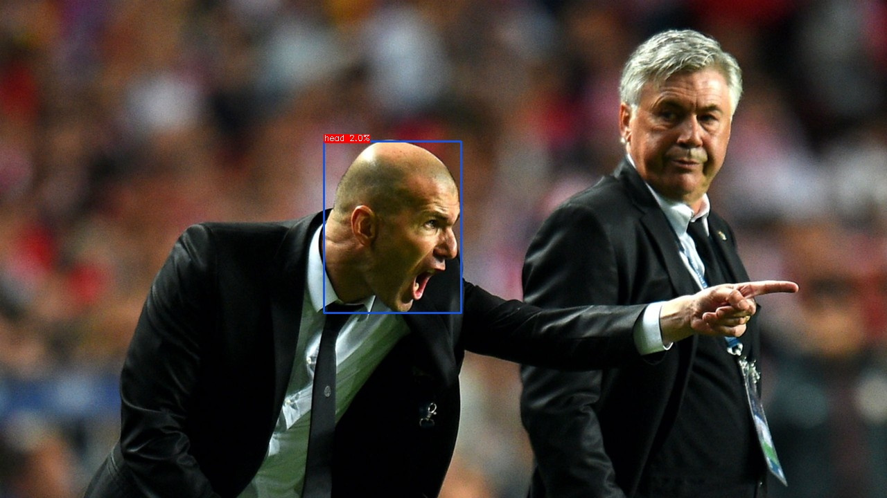
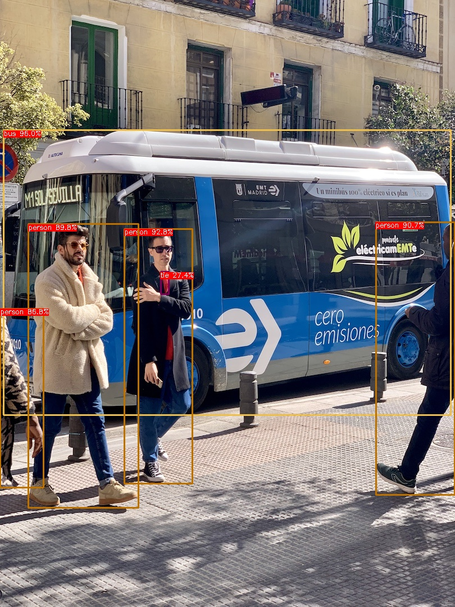
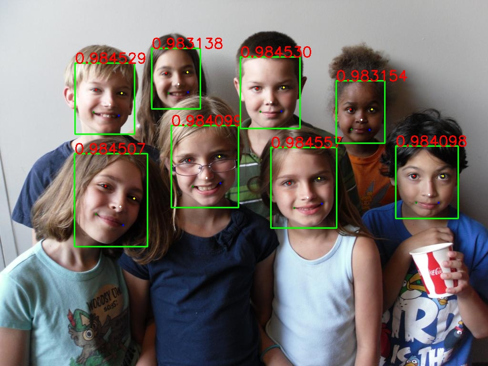

# <div align="center">TENSORRT CPP FOR ONNX</d>
 

Tensorrt codebase in c++ to inference for all major neural arch using onnx and dynamic batching


## <div align="left">NVIDIA Driver</d>

```bash

wget https://developer.download.nvidia.com/compute/cuda/12.4.0/local_installers/cuda_12.4.0_550.54.14_linux.run

sudo sh cuda_12.4.0_550.54.14_linux.run

```

## <div align="left">Docker</d>

```bash

sudo docker build -t trt_24.02_opencv  .

sudo docker run --rm --network="host" -v $(pwd):/app -it --runtime nvidia trt_24.02_opencv bash
```

## <div align="center">Models</div>

### <div align="left">Depth anything v2</div>

<details>
<summary>Model Conversion</summary>

url = https://github.com/DepthAnything/Depth-Anything-V2.git

- Clone the Depth-Anything
```bash

git clone https://github.com/DepthAnything/Depth-Anything-V2.git
cd Depth-Anything-V2/
pip3 install -r requirements.txt

Follow steps for making onnx model files
Download the model from here https://github.com/DepthAnything/Depth-Anything-V2?tab=readme-ov-file#prepraration


git clone https://github.com/spacewalk01/depth-anything-tensorrt.git
cp depth_anything_v2/dpt.py ../depth_anything_v2/
cp depth_anything_v2/export_v2.py ../
cd ..

python3.11 export_v2.py --encoder vitb --input-size 518
Model exported to depth_anything_v2_vitb.onnx

python3.11 export_v2.py --encoder vits --input-size 518
Model exported to depth_anything_v2_vits.onnx

git clone https://github.com/PrinceP/tensorrt-cpp-for-onnx


// Move <model_version>.onnx file to 'examples/depth-anything'
cp depth_anything_v2_vit<b/s/l>.onnx /app/examples/depth-anything

mkdir build
cd build
cmake ..
make -j4

./depth_anything_v2 /app/examples/depth-anything/depth_anything_v2_vit<b/s/l>.onnx /app/data/depth-anything/

// Check the results folder
```

</details>

<details>
<summary>Results</summary>

**Results  [depth_anything_v2_vitb, Batchsize = 1, Model size = 518x518]**

<div style="display: flex; justify-content: center;
padding: 10px">
    
</div>
<div style="display: flex; justify-content: center;
padding: 10px">
    
</div>
</details>

### <div align="left">YOLO-World</div>

<details>
<summary>Model Conversion</summary>

url = https://github.com/AILab-CVC/YOLO-World

- Clone the YOLO-World
```bash

git clone https://github.com/AILab-CVC/YOLO-World

Follow steps for installation
https://github.com/AILab-CVC/YOLO-World?tab=readme-ov-file#1-installation

Define custom classes(Any name can be defined)
echo '[["helmet"], ["head"],["sunglasses"]]' > custom_class.json

PYTHONPATH=./ python3 deploy/export_onnx.py configs/pretrain/yolo_world_v2_s_vlpan_bn_2e-3_100e_4x8gpus_obj365v1_goldg_train_lvis_minival.py yolo_world_v2_s_obj365v1_goldg_pretrain-55b943ea.pth --custom-text custom_class.json --opset 12 --without-nms

After the fix https://github.com/AILab-CVC/YOLO-World/pull/416
python3 deploy/onnx_demo.py ./work_dirs/yolo_world_v2_s_obj365v1_goldg_pretrain-55b943ea.onnx ~/disk1/uncanny/projects/tensorrt-cpp-for-onnx/data/ custom_class.json  --onnx-nms

git clone https://github.com/PrinceP/tensorrt-cpp-for-onnx

Adjust settings in the ./examples/yolo-world/main.cpp 
0.019/*score_threshold*/, 0.7/*iou_threshold*/, 300/*max_detections*/

// Move <model_version>.onnx file to 'examples/yolo-world'
cp cp ./work_dirs/<model_version>.onnx /app/examples/yolo-world

mkdir build
cd build
cmake ..
make -j4

./yolo-world /app/examples/yolo-world/<model_version>.onnx /app/data/

// Check the results folder
```

</details>

<details>
<summary>Results</summary>

**Results  [yolo_world_v2_s_obj365v1_goldg_pretrain, Batchsize = 1, Model size = 640x640]**

<div style="display: flex; justify-content: center;
padding: 10px">
    
</div>
<div style="display: flex; justify-content: center;
padding: 10px">
    
</div>
<div style="display: flex; justify-content: center; padding: 10px">
    
</div>
</details>

### <div align="left">RT-DETR</div>

<details>
<summary>Model Conversion</summary>

url = https://github.com/lyuwenyu/RT-DETR.git

- Clone the RT-DETR
```bash

git clone https://github.com/lyuwenyu/RT-DETR.git

Follow steps from here 

Version1
https://github.com/lyuwenyu/RT-DETR/blob/main/rtdetr_pytorch/README.md#todo

Version2
https://github.com/lyuwenyu/RT-DETR/tree/main/rtdetrv2_pytorch#quick-start

Any of above can run.

git clone https://github.com/PrinceP/tensorrt-cpp-for-onnx

// Move <model_version>.onnx file to 'examples/rt-detr'
cp <model_version>.onnx /app/examples/rt-detr

mkdir build
cd build
cmake ..
make -j4

./rt-detr /app/examples/rt-detr/<model_version>.onnx /app/data/

// Check the results folder
```

</details>

<details>
<summary>Results</summary>

**Results  [RT-DETRv2-S, Batchsize = 2, Model size = 640x640]**

<div style="display: flex; justify-content: center;
padding: 10px">
    
</div>
<div style="display: flex; justify-content: center;
padding: 10px">
    
</div>
<div style="display: flex; justify-content: center; padding: 10px">
    
</div>
</details>


### <div align="left">YOLOV10</div>

<details>
<summary>Model Conversion</summary>

url = https://github.com/THU-MIG/yolov10

- Clone the yolov10
```bash

git clone https://github.com/THU-MIG/yolov10

yolo export model=yolov10n/s/m/b/l/x.pt format=onnx opset=13 simplify dynamic

git clone https://github.com/PrinceP/tensorrt-cpp-for-onnx

// Move <model_version>.onnx file to 'examples/yolov10'
cp <model_version>.onnx /app/examples/yolov10

mkdir build
cd build
cmake ..
make -j4

./yolov10 /app/examples/yolov10/<model_version>.onnx /app/data/

// Check the results folder
```

</details>

<details>
<summary>Results</summary>

**Results  [YOLOv10m, Batchsize = 2, Model size = 640x640]**

<div style="display: flex; justify-content: center;
padding: 10px">
    
</div>
<div style="display: flex; justify-content: center;
padding: 10px">
    
</div>
<div style="display: flex; justify-content: center; padding: 10px">
    
</div>
</details>


### <div align="left">YOLOV9</div>

<details>
<summary>Model Conversion</summary>

url = https://github.com/WongKinYiu/yolov9.git

commit 380284cb66817e9ffa30a80cad4c1b110897b2fb

- Clone the yolov9
```bash

git clone https://github.com/WongKinYiu/yolov9

python3 export.py --weights <model_version>.pt --include onnx_end2end

git clone https://github.com/PrinceP/tensorrt-cpp-for-onnx

// Move <model_version>-end2end.onnx file to 'examples/yolov9'
cp <model_version>-end2end.onnx /app/examples/yolov9

mkdir build
cd build
cmake ..
make -j4

./yolov9 /app/examples/yolov9/<model_version>-end2end.onnx /app/data/

// Check the results folder
```

</details>

<details>
<summary>Results</summary>

**Results  [YOLOv9-C, Batchsize = 2, Model size = 640x640]**

<div style="display: flex; justify-content: center;
padding: 10px">
    
</div>
<div style="display: flex; justify-content: center;
padding: 10px">
    
</div>
<div style="display: flex; justify-content: center; padding: 10px">
    
</div>
</details>

### <div align="left">YOLOV8-Detect</div>

<details>
<summary>Model Conversion</summary>

url = https://github.com/ultralytics/ultralytics

ultralytics==8.1.24

- Install ultralytics package in python
```python

from ultralytics import YOLO

model = YOLO('yolov8s.pt')
model.export(format='onnx', dynamic=True)
```
```bash
git clone https://github.com/PrinceP/tensorrt-cpp-for-onnx

// Move <model_version>.onnx file to 'examples/yolov8'
cp <model_version>.onnx /app/examples/yolov8

mkdir build
cd build
cmake ..
make -j4

./yolov8-detect /app/examples/yolov8/<model_version>.onnx /app/data/

// Check the results folder
```

</details>

<details>
<summary>Results</summary>

**Results  [YOLOv8s, Batchsize = 2, Model size = 640x640]**

<div style="display: flex; justify-content: center;
padding: 10px">
    
</div>
<div style="display: flex; justify-content: center;
padding: 10px">
    
</div>
<div style="display: flex; justify-content: center; padding: 10px">
    
</div>
</details>

### <div align="left">YOLOV8-Segment</div>

<details>
<summary>Model Conversion</summary>

url = https://github.com/ultralytics/ultralytics

ultralytics==8.1.24

- Install ultralytics package in python
```python

from ultralytics import YOLO

# Load a model
model = YOLO('yolov8n-seg.pt')

# Export the model
model.export(format='onnx', dynamic=True)
```
```bash
git clone https://github.com/PrinceP/tensorrt-cpp-for-onnx

// Move <model_version>.onnx file to 'examples/yolov8'
cp <model_version>.onnx /app/examples/yolov8

mkdir build
cd build
cmake ..
make -j4

./yolov8-segment /app/examples/yolov8/<model_version>.onnx /app/data/

// Check the results folder
```

</details>

<details>
<summary>Results</summary>

**Results  [YOLOv8n, Batchsize = 2, Model size = 640x640]**

<div style="display: flex; justify-content: center;
padding: 10px">
    
</div>
<div style="display: flex; justify-content: center;
padding: 10px">
    
</div>
<div style="display: flex; justify-content: center; padding: 10px">
    
</div>
</details>

### <div align="left">YOLOV8-Pose</div>

<details>
<summary>Model Conversion</summary>

url = https://github.com/ultralytics/ultralytics

ultralytics==8.1.24

- Install ultralytics package in python
```python

from ultralytics import YOLO

# Load a model
model = YOLO('yolov8n-pose.pt')

# Export the model
model.export(format='onnx', dynamic=True)
```
```bash
git clone https://github.com/PrinceP/tensorrt-cpp-for-onnx

// Move <model_version>.onnx file to 'examples/yolov8'
cp <model_version>.onnx /app/examples/yolov8

mkdir build
cd build
cmake ..
make -j4

./yolov8-pose /app/examples/yolov8/<model_version>.onnx /app/data/

// Check the results folder
```

</details>

<details>
<summary>Results</summary>

**Results  [YOLOv8n, Batchsize = 2, Model size = 640x640]**

<div style="display: flex; justify-content: center;
padding: 10px">
    
</div>
<div style="display: flex; justify-content: center;
padding: 10px">
    
</div>
<div style="display: flex; justify-content: center; padding: 10px">
    
</div>
</details>


### <div align="left">YOLOV8-OBB</div>

<details>
<summary>Model Conversion</summary>

url = https://github.com/ultralytics/ultralytics

ultralytics==8.1.24

- Install ultralytics package in python
```python

from ultralytics import YOLO

# Load a model
model = YOLO('yolov8n-obb.pt')

# Export the model
model.export(format='onnx', dynamic=True)

```
```bash
git clone https://github.com/PrinceP/tensorrt-cpp-for-onnx

// Move <model_version>.onnx file to 'examples/yolov8'
cp <model_version>.onnx /app/examples/yolov8

mkdir build
cd build
cmake ..
make -j4

./yolov8-obb /app/examples/yolov8/<model_version>.onnx /app/data/obb/

// Check the results folder
```

</details>

<details>
<summary>Results</summary>

**Results  [YOLOv8n, Batchsize = 2, Model size = 640x640]**

<div style="display: flex; justify-content: center;
padding: 10px">
    
</div>
<div style="display: flex; justify-content: center;
padding: 10px">
    
</div>
<div style="display: flex; justify-content: center; padding: 10px">
    
</div>
</details>

### <div align="left">YOLOV8-Classify</div>

<details>
<summary>Model Conversion</summary>

url = https://github.com/ultralytics/ultralytics

ultralytics==8.1.24

- Install ultralytics package in python
```python

from ultralytics import YOLO

# Load a model
model = YOLO('yolov8n-cls.pt')

# Export the model
model.export(format='onnx', dynamic=True)

```
```bash
git clone https://github.com/PrinceP/tensorrt-cpp-for-onnx

// Move <model_version>.onnx file to 'examples/yolov8'
cp <model_version>.onnx /app/examples/yolov8

mkdir build
cd build
cmake ..
make -j4

./yolov8-classify /app/examples/yolov8/<model_version>.onnx /app/data/classify/

// Check the results folder
```

</details>

<details>
<summary>Results</summary>

**Results  [YOLOv8n, Batchsize = 2, Model size = 224x224]**

<div style="display: flex; justify-content: center;
padding: 10px">
    
</div>
<div style="display: flex; justify-content: center;
padding: 10px">
    
</div>
</details>


### <div align="left">YOLOV5-Face</div>

<details>
<summary>Model Conversion</summary>

url = https://github.com/deepcam-cn/yolov5-face


- Install onnx==1.16.2, tqdm, thop, seaborn, torch==1.9, torchvision==0.10

- Changes for dynamic shape
```txt
diff --git a/export.py b/export.py
index 1aa7dae..2502e23 100644
--- a/export.py
+++ b/export.py
@@ -75,14 +75,22 @@ if __name__ == '__main__':
     print('\nStarting ONNX export with onnx %s...' % onnx.__version__)
     f = opt.weights.replace('.pt', '.onnx')  # filename
     model.fuse()  # only for ONNX
-    input_names=['input']
-    output_names=['output']
-    torch.onnx.export(model, img, f, verbose=False, opset_version=12, 
+    
+    # Dynamic batching support
+    input_names = [ "input" ]
+    output_names = [ "output" ]
+    dynamic_axes={'input' : {0 : 'batch_size'}, 'output' : {0 : 'batch_size'}}
+    dynamic_axes['input'][2] = 'height'
+    dynamic_axes['input'][3] = 'width'
+    
+    torch.onnx.export(model, img, f, verbose=True, opset_version=12, 
         input_names=input_names,
         output_names=output_names,
+        # dynamic_axes = dynamic_axes
         dynamic_axes = {'input': {0: 'batch'},
                         'output': {0: 'batch'}
                         } if opt.dynamic else None)
+    # )
 
     # Checks
     onnx_model = onnx.load(f)  # load onnx model
```
- Convert pytorch to onnx
```bash
python3 export.py --weights ./yolov5s-face.pt --dynamic
```

```bash
git clone https://github.com/PrinceP/tensorrt-cpp-for-onnx

// Move <model_version>.onnx file to 'examples/yolov5-face'
cp <model_version>.onnx /app/examples/yolov5-face

mkdir build
cd build
cmake ..
make -j4

./yolov5-face /app/examples/yolov5-face/<model_version>.onnx /app/data/yolov5-face/

// Check the results folder
```

</details>

<details>
<summary>Results</summary>

**Results  [YOLOv5s-face, Batchsize = 2, Model size = 640x640]**

<div style="display: flex; justify-content: center;
padding: 10px">
    
</div>
</details>

### <div align="left">NOTES</div>
<details>
<summary>Issues</summary>

- Dynamic batching is supported. The batchsize and image sizes can be updated in the codebase.

- Dynamic batch issue resolved for yolov10: https://github.com/THU-MIG/yolov10/issues/27

- Dynamic batch not present for Yolo-World

- If size issue happens while building. Increase the workspaceSize

```bash
    Internal error: plugin node /end2end/EfficientNMS_TRT requires XXX bytes of scratch space, but only XXX is available. Try increasing the workspace size with IBuilderConfig::setMemoryPoolLimit().
```
```cpp
    config->setMaxWorkspaceSize(1U << 26) 
    //The current memory is 2^26 bytes
```
</details>
